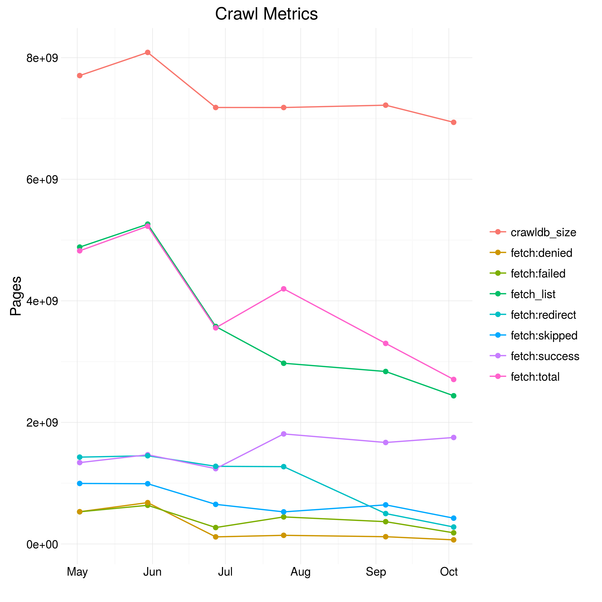
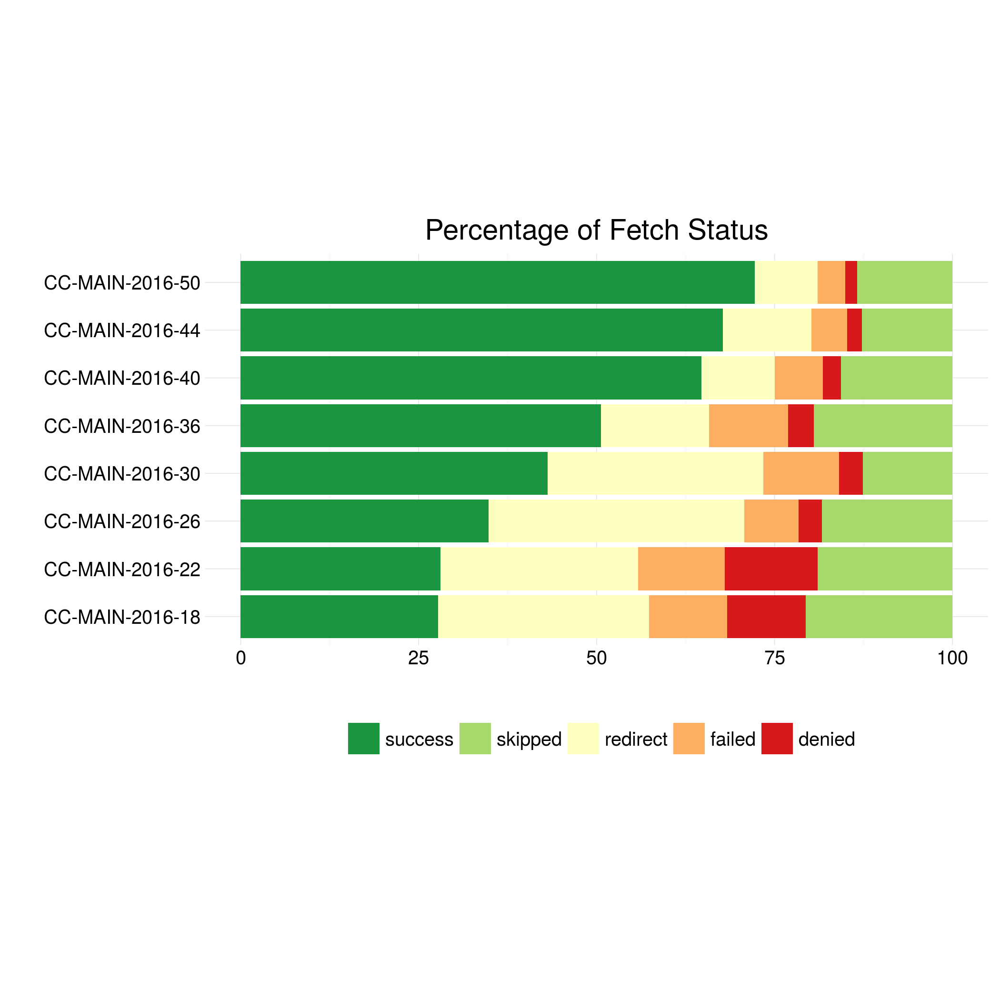

Crawler-Related Metrics
=======================

Crawler-related metrics are extracted from the crawler log files, cf. [../stats/crawler/].
Metrics include
- the size of the URL database (CrawlDb)
- the fetch list size (number of URLs scheduled for fetching)
- the response status of the fetch:
  - success
  - redirect
  - denied (forbidden by HTTP 403 or robots.txt)
  - failed (404, host not found, etc.)

The first plot shows absolute number for the metrics.

The relative portion of the fetch status is shown in the second graphics.

