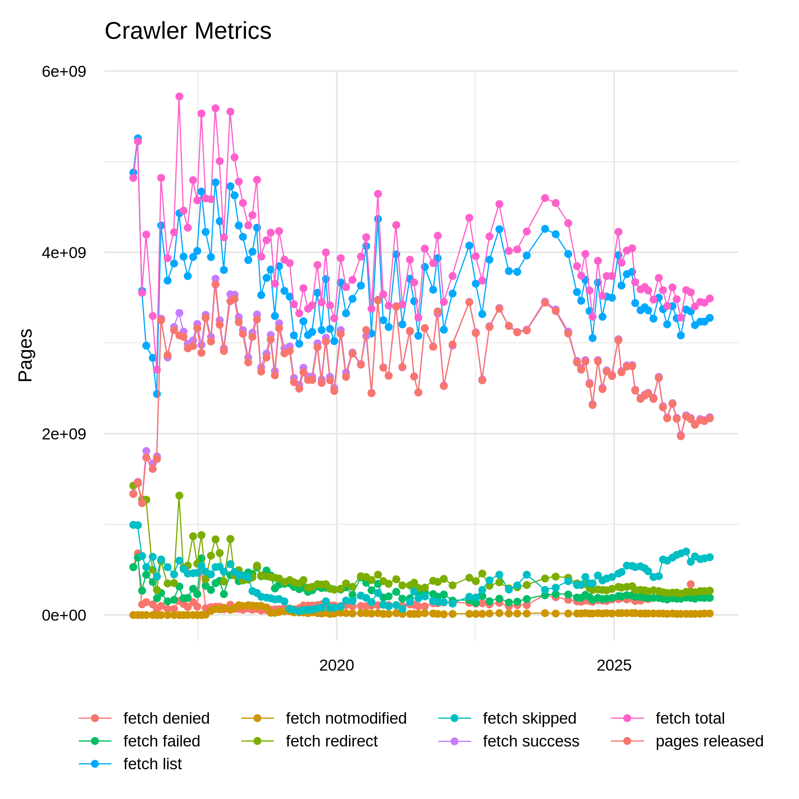
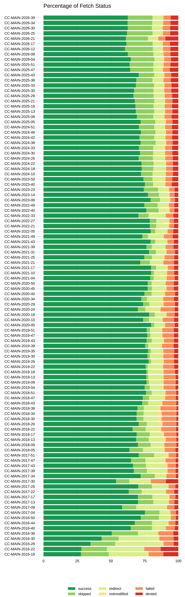
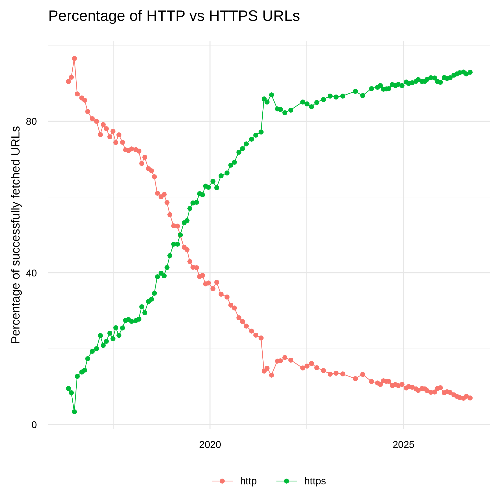
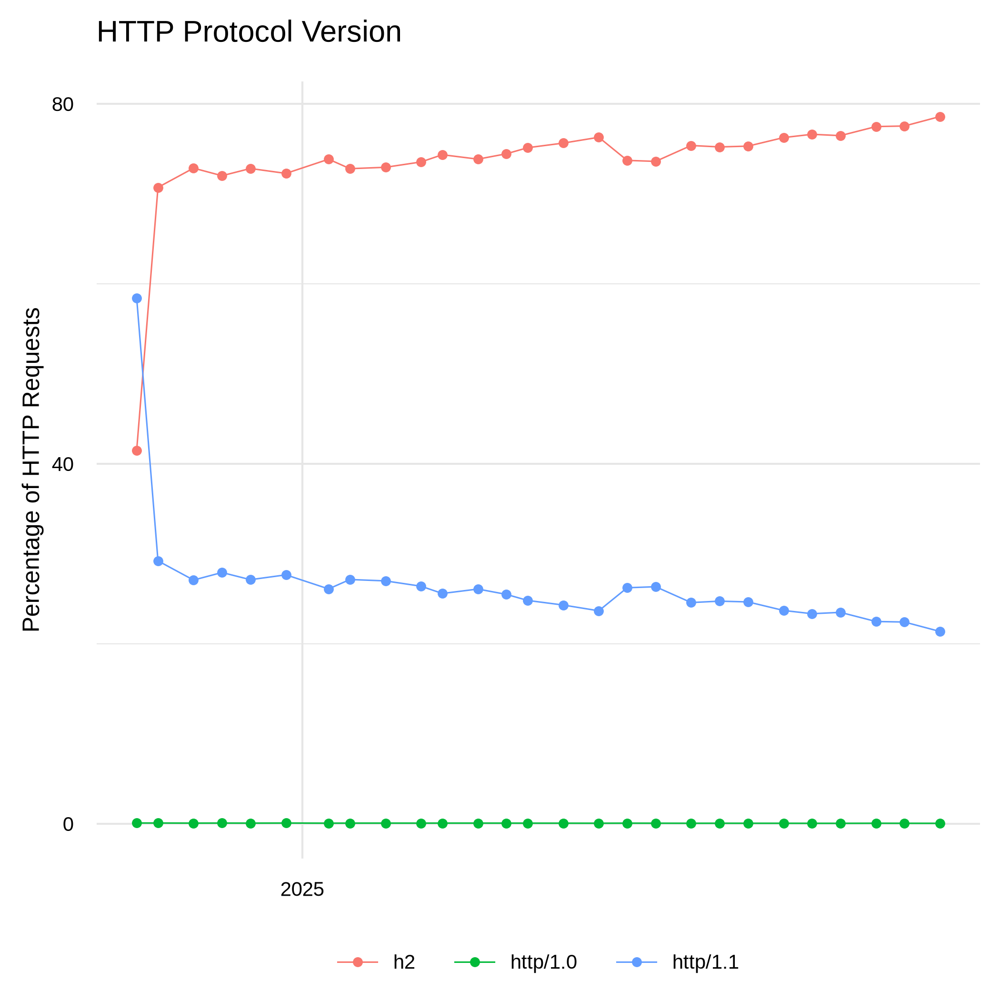
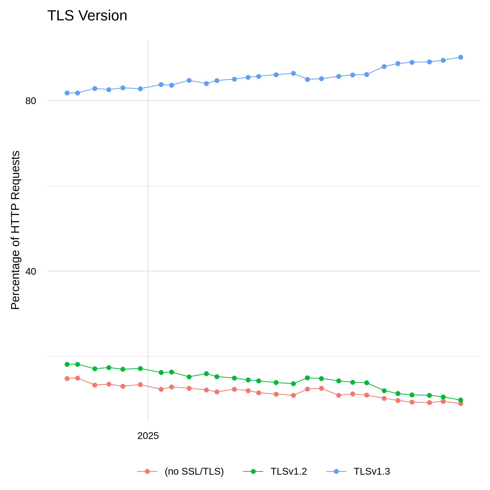
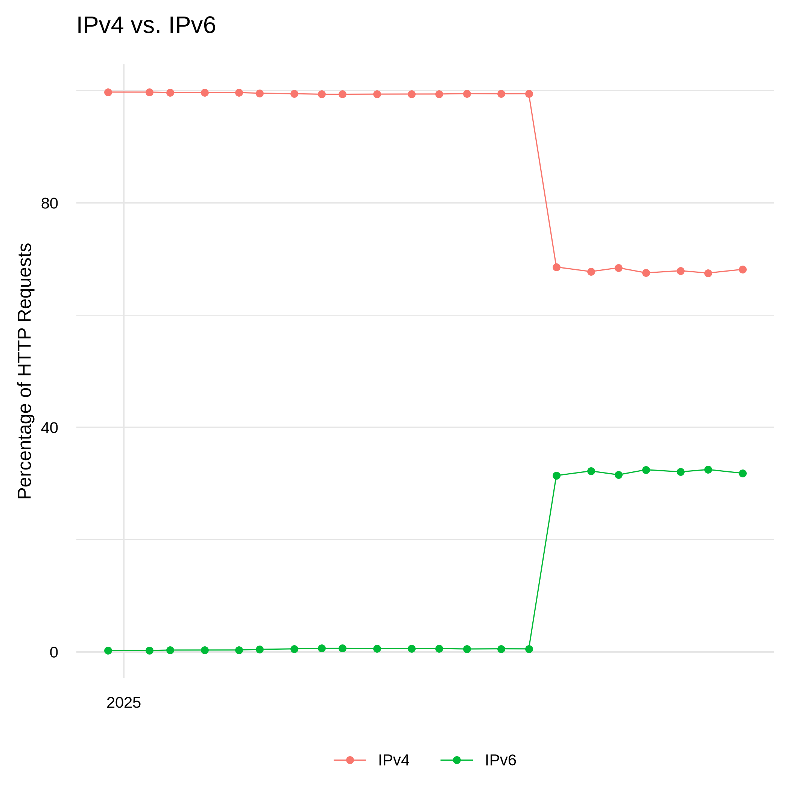
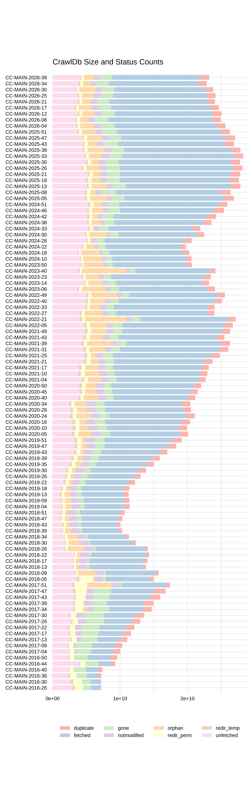

Crawler-Related Metrics
=======================

Every monthly crawl is a funnel: a large database of known URLs (the CrawlDb),
a fetch list sampled from it, the fetches themselves with their outcomes, and
finally the pages released in the crawl archives. The metrics on this page
follow that funnel over time. They are extracted from the crawler log files,
cf. [../stats/crawler/](https://github.com/commoncrawl/cc-crawl-statistics/blob/master/stats/crawler/),
and include

- the size of the URL database (CrawlDb)
- the fetch list size — the number of URLs scheduled for fetching in a monthly crawl
- the status of every fetch:
  - *success* — page fetched successfully
  - *notmodified* — page unchanged since the last fetch (HTTP 304)
  - *redirect* — temporary or permanent redirects
  - *denied* — forbidden by HTTP 403 or robots.txt
  - *failed* — 404, host not found and other errors
  - *skipped* — not fetched because of time limits or per-host thresholds
- the usage of http:// vs. https:// URL protocols (schemes) and HTTP protocol
  and IP address versions

Crawler log files have been archived since 2016. There are no metrics
available for the years 2008 – 2015.

## Fetch Status Counts

The first plot shows all crawler metrics of a monthly crawl in one figure:
the *fetch list* — the URLs scheduled for fetching by the generator —, the
*fetch total* — the URLs actually processed by the fetcher —, the counts of
the fetch statuses, and the *pages released* in the crawl archives. Two
equations connect the metrics. The fetch total exceeds the fetch list because
the targets of redirects are queued and fetched in addition to the scheduled
URLs, and every processed URL ends in exactly one fetch status:

> fetch total &nbsp;≈&nbsp; fetch list + followed redirects
>
> fetch total &nbsp;=&nbsp; success + notmodified + redirect + denied + failed + skipped

Note that URLs dropped when the crawl hits its time limit are counted as
*skipped*.

(Crawler metrics: [metrics.csv](./crawler/metrics.csv))

How do the fetches end relative to each other? The next figure shows the
outcome shares per crawl.
The success rate climbed from below 30% in the first crawls to around 80%,
and has declined again in recent years. The low rates of 2016 — and of the
preceding years, for which no fetch status was tracked — stem from the
dependency on donated seed lists, which tended to be outdated and caused
many redirects and 404s. The recent decline has different reasons: more
sites disallow crawling via robots.txt or deny it with HTTP 403, and the
exponential backoff introduced in 2022 increases the number of skipped
URLs.
This figure and the CrawlDb figure at the bottom of the page draw one bar
per crawl on a shared date axis, so the irregular intervals between crawls
are visible and both plots can be compared directly.

(Percentage of fetch status: [fetch_status_percentage.csv](./crawler/fetch_status_percentage.csv))

## Protocols and IP Address Versions

The next figure shows the relative usage of http:// and https:// URLs among
the successfully fetched pages. The increasing adoption of HTTPS on the web is
clearly reflected, although crawler properties (sampling, deduplication and
URL canonicalization) also influence the amount of HTTPS URLs in a single
monthly crawl.

(Protocol counts – http vs. https: [url_protocols_percentage.csv](./crawler/url_protocols_percentage.csv))

HTTP protocol and TLS versions are tracked since the crawler started to support [HTTP/2](https://en.wikipedia.org/wiki/HTTP/2) during the [July 2024 crawl](https://blog.commoncrawl.org/blog/july-2024-crawl-archive-now-available).

(HTTP protocol version counts: [http_protocol_version.csv](./crawler/http_protocol_version.csv))

(TLS protocol version counts: [tls_protocol_version.csv](./crawler/tls_protocol_version.csv))

In [December 2024](https://blog.commoncrawl.org/blog/december-2024-crawl-archive-now-available) CCBot has added support for IPv6. Initially, with preference for IPv4, since [March 2026](https://blog.commoncrawl.org/blog/march-2026-crawl-archive-now-available) using the Happy Eyeballs RFC ([RFC 6555](https://datatracker.ietf.org/doc/html/rfc6555)).

(IP address version counts: [ip_address_version.csv](./crawler/ip_address_version.csv))

## URL Database (CrawlDb)

Behind every fetch list stands the CrawlDb, which stores URLs together with
fetch time, status, content checksum and various other metadata. HTTP response
codes are mapped to coarse
[CrawlDatum states](https://cwiki.apache.org/confluence/display/NUTCH/CrawlDatumStates),
and so are other status signals, such as disallowed by robots.txt or the
result of a deduplication job. Because new URLs are added permanently, the
CrawlDb keeps growing and requires a periodic cleanup which removes stale
URLs — visible as the drops in 2018, 2022 and 2024. The figure below shows
the development of the CrawlDb over time, including the counts of the
CrawlDatum states, recorded before the fetching of each monthly crawl. The
states are stacked in lifecycle order: successfully fetched pages at the
bottom, then redirects, dead and duplicate URLs, and on top the frontier of
known but not yet fetched URLs.

(CrawlDb size and status counts: [crawldb_status.csv](./crawler/crawldb_status.csv))
