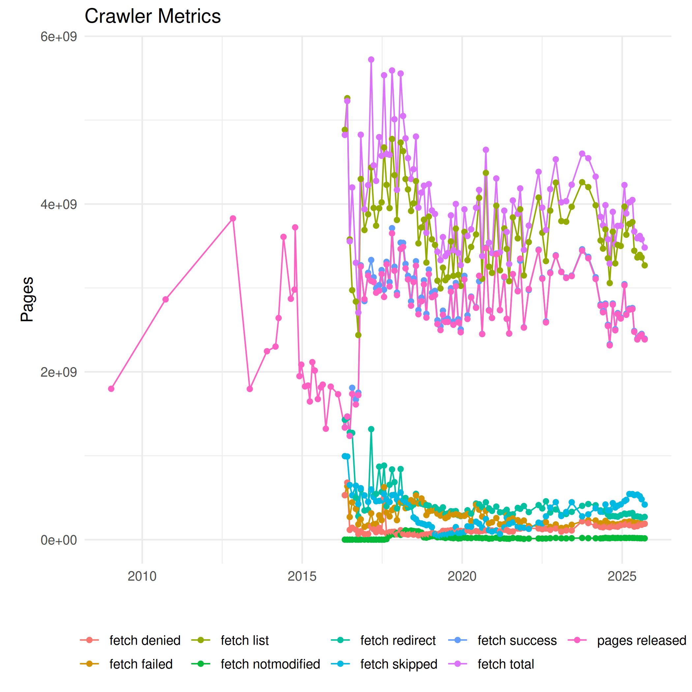
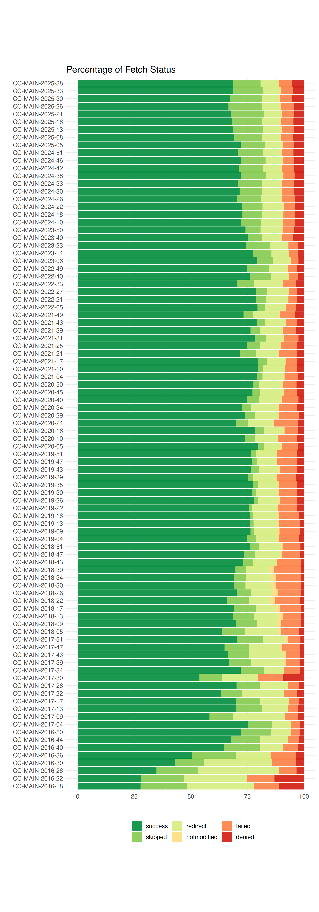
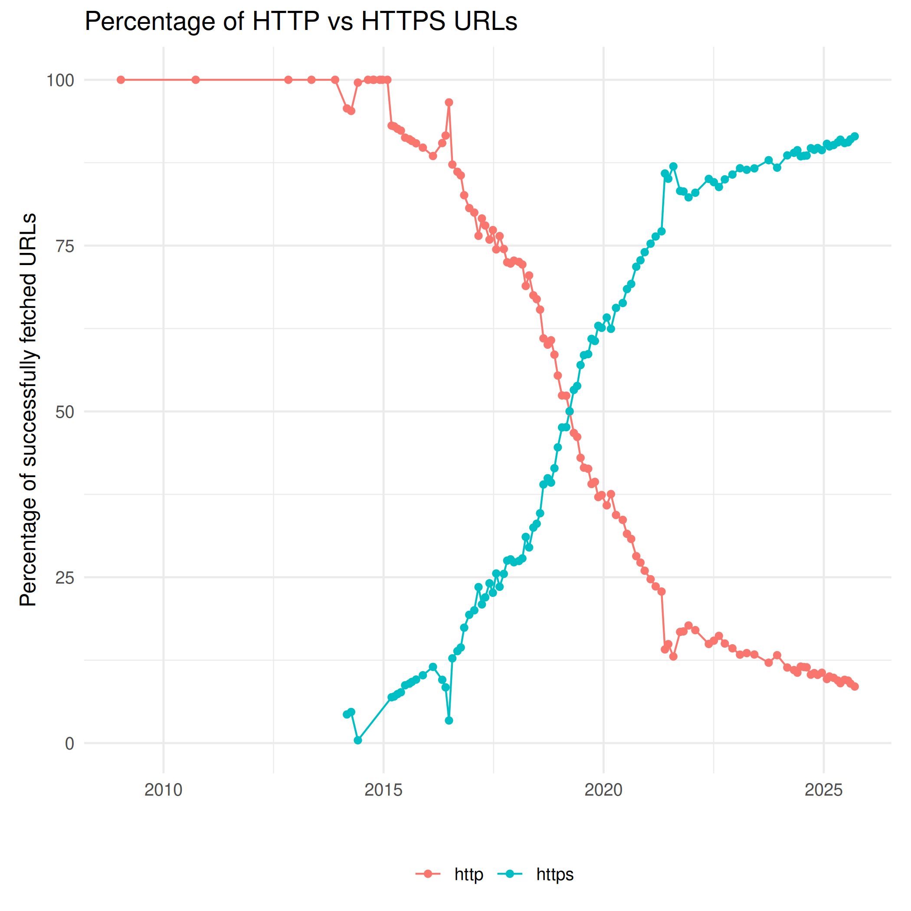
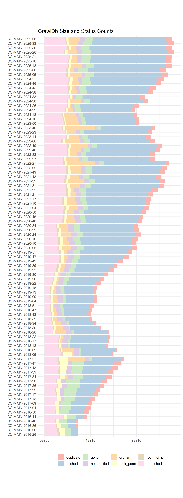

Crawler-Related Metrics
=======================

Crawler-related metrics are extracted from the crawler log files, cf. [../stats/crawler/](https://github.com/commoncrawl/cc-crawl-statistics/blob/master/stats/crawler/) and include
- the size of the URL database (CrawlDb)
- the fetch list size (number of URLs scheduled for fetching)
- the response status of the fetch:
  - success
  - redirect
  - denied (forbidden by HTTP 403 or robots.txt)
  - failed (404, host not found, etc.)
- usage of http/https URL protocols (schemes)

The first plot shows absolute number for the metrics.

The relative portion of the fetch status is shown in the second graphics.

The next figure shows the relative usage of http and https URL protocols (schemes). The increasing usage HTTPS on the web is reflected. But also crawler properties such as sampling, deduplication and URL canonicalization) may influence the actual amount of HTTPS URLs in a single monthly crawl.

The crawls are backed by a CrawlDb which stores URLs, fetch time, status information, content checksum and various other metadata. HTTP response codes are mapped to coarse [CrawlDatum states](https://cwiki.apache.org/confluence/display/NUTCH/CrawlDatumStates) and so are other status signals, such as disallowed by robots.txt or the result of a deduplication job. By adding permanently new URLs, the CrawlDb is growing and requires a permanent cleanup which removes stale URLs. The figure below shows the development of the CrawlDb over time, including the amount of CrawlDatum states. Size and counts are recorded before the fetching of a monthly crawl.

