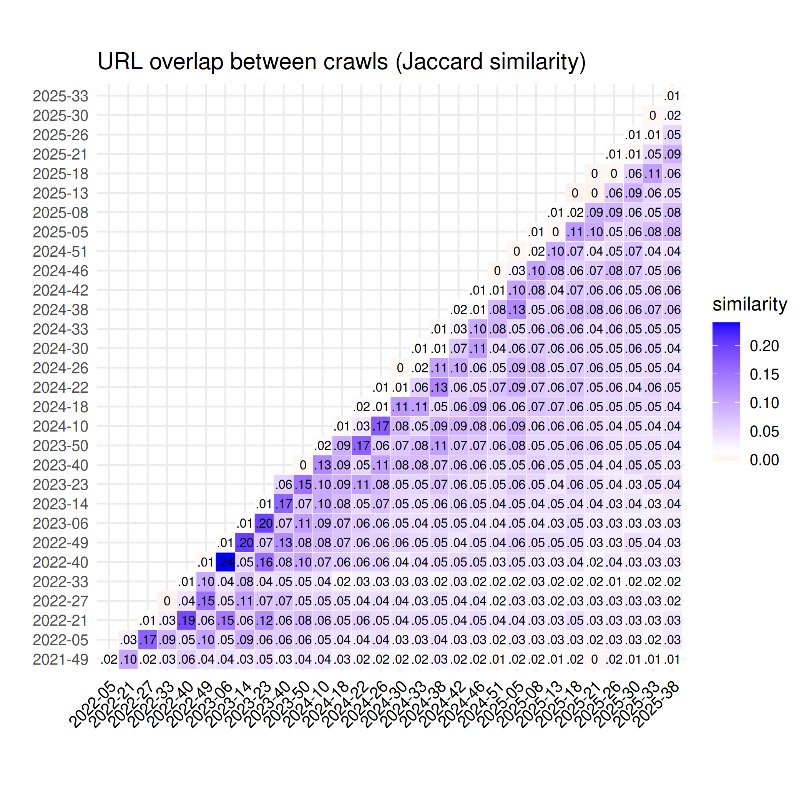

Overlaps between Common Crawl Monthly Archives
==============================================

Overlaps between monthly crawl archives are calculated and plotted as [Jaccard similarity](https://en.wikipedia.org/wiki/Jaccard_index) of unique URLs or content digests. The cardinality of the monthly crawls and the union of two crawls are [Hyperloglog](https://en.wikipedia.org/wiki/HyperLogLog) estimates, cf. [plot/overlap.py](https://github.com/commoncrawl/cc-crawl-statistics/blob/master/plot/overlap.py) for details.

Note, that the content overlaps are small and in the same order of magnitude as the 1% error rate of the Hyperloglog cardinality estimates.
