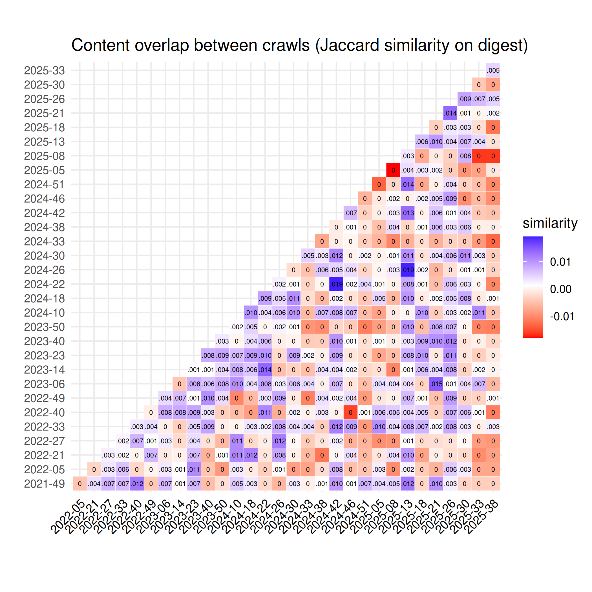

Overlaps between Common Crawl Monthly Archives
==============================================

Overlaps between monthly crawl archives are calculated and plotted as [Jaccard similarity](https://en.wikipedia.org/wiki/Jaccard_index) of unique URLs or content digests. The cardinality of the monthly crawls and the union of two crawls are Hyperloglog estimates. Cf. [plot_overlap.py](../plot_overlap.py) for details.

) between Common Crawl monthly crawls](./crawloverlap/crawlsimilarity_matrix_url.png)

Note, that the content overlaps are small and in the same order of magnitude as the 1% error rate of the Hyperloglog cardinality estimations.