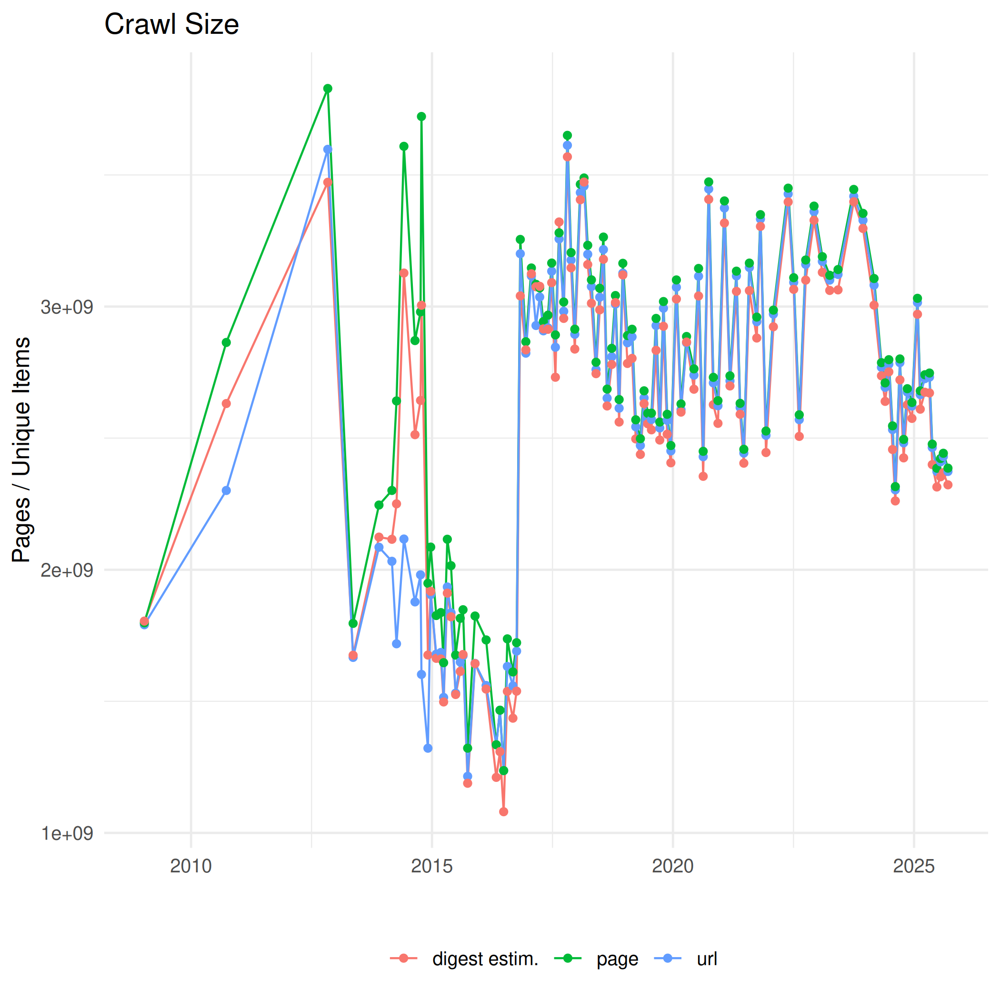
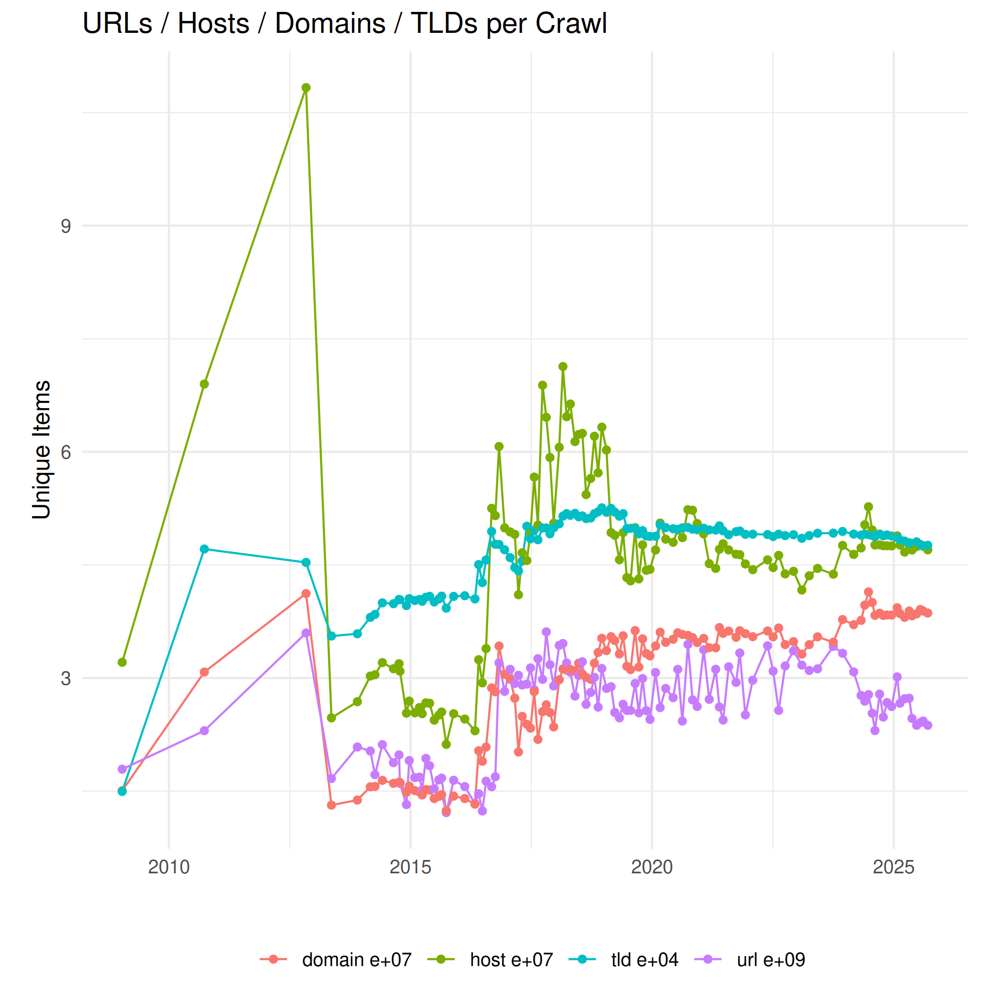
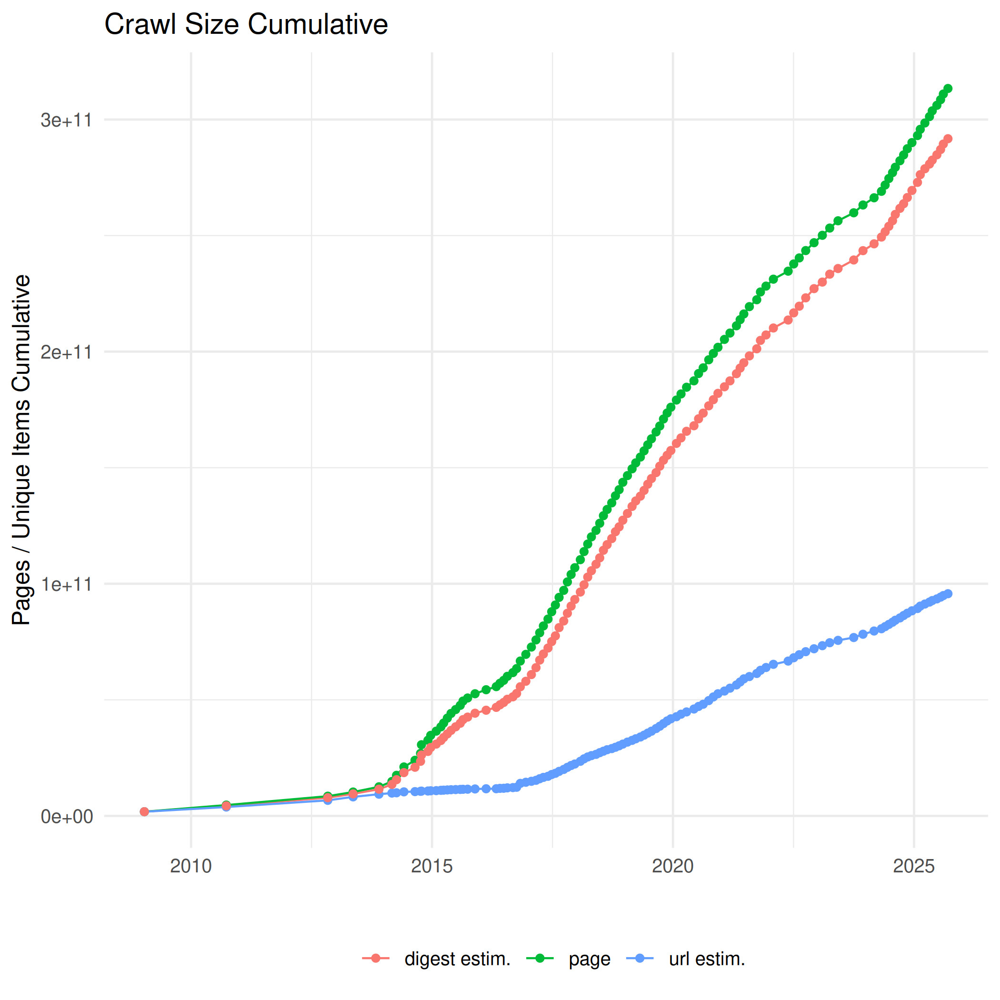
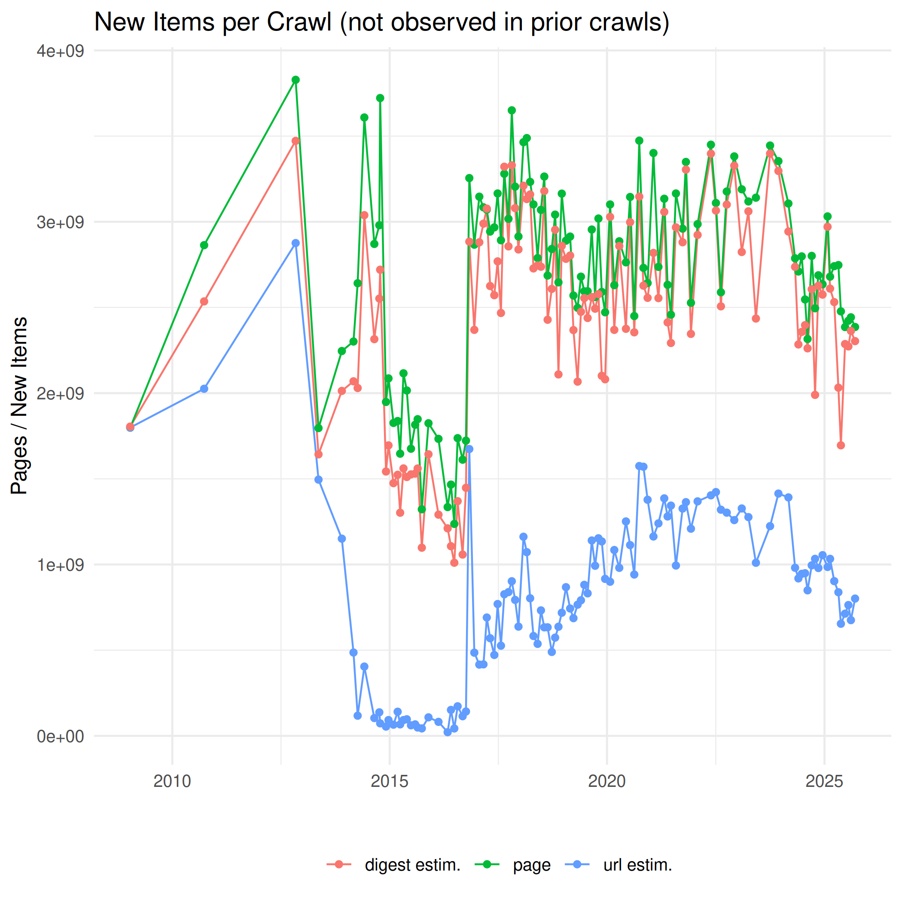
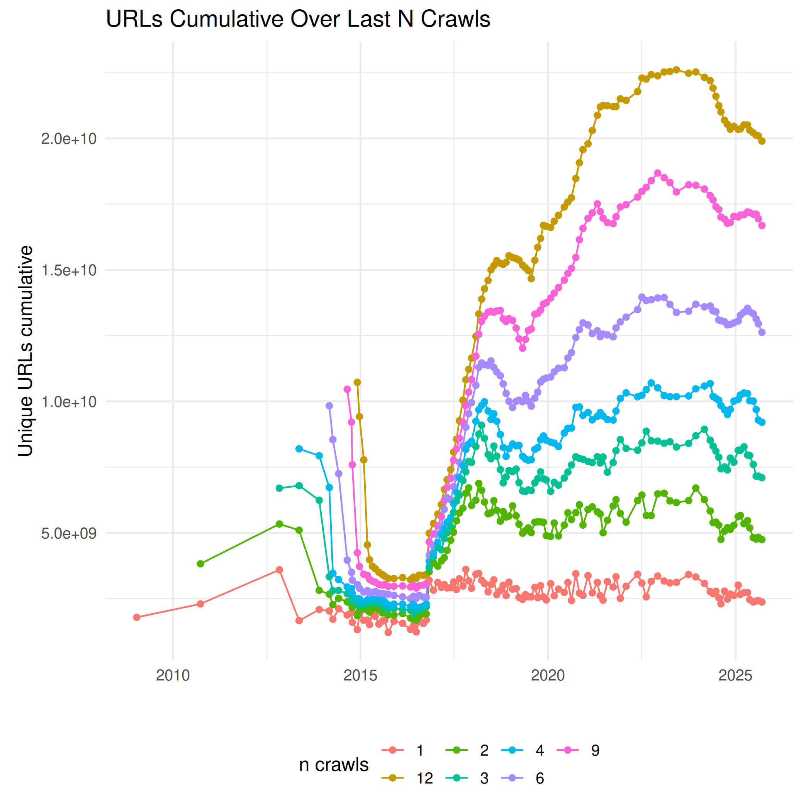
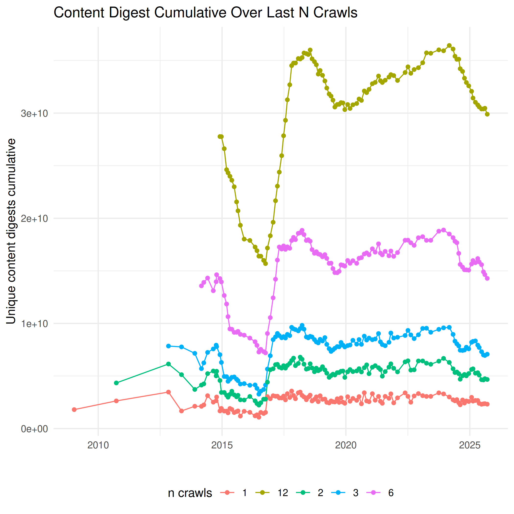

Size of Common Crawl Monthly Archives
=====================================

The number of released pages per month fluctuates varies over time due to changes to the number of available seeds, scheduling policy for page revists and crawler operating issues. Because of duplicates the numbers of unique URLs or unique content digests (here Hyperloglog estimates) are lower than the number of page captures.

([Number of page captures, unique URLs and content digests as CSV](./crawlsize/monthly.csv))

The size on various aggregation levels (host, domain, top-level domain / public suffix) is shown in the next plot. Note that the scale differs per level of aggregation, see the exponential notation behind the labels.

([Unique URLs, host and domain names, top-level domains (public suffixes) as CSV](./crawlsize/domain.csv))

## Cumulative Size

Every monthly crawl is a sample of the web and we try to make every monthly snapshot a representative and diverse sample by its own. We also try to make the sample diverse in time to cover more content over time while still providing fresh and frequent snapshots of popular pages. This and the following plots are based on Hyperloglog cardinality estimates with 1% error rate.

The next plot shows the difference in the cumulative size to the preceding crawl. In other words, the amount of new URLs or new content not observed in any of the preceding monthly crawls.

([New items per crawl as CSV](./crawlsize/monthly_new.csv))

How many unique items (in terms of URLs or unique content by digest) are covered by the last n crawls? The coverage over certain time intervals went down early 2015 when continuous donations of verified seeds stopped. Since autumn 2016 we are able to extend the crawl by our own, and we try to increase the coverage for the last n crawls.

([Combined number of unique URLs over n last crawls as CSV](./crawlsize/url_last_n_crawls.csv))

