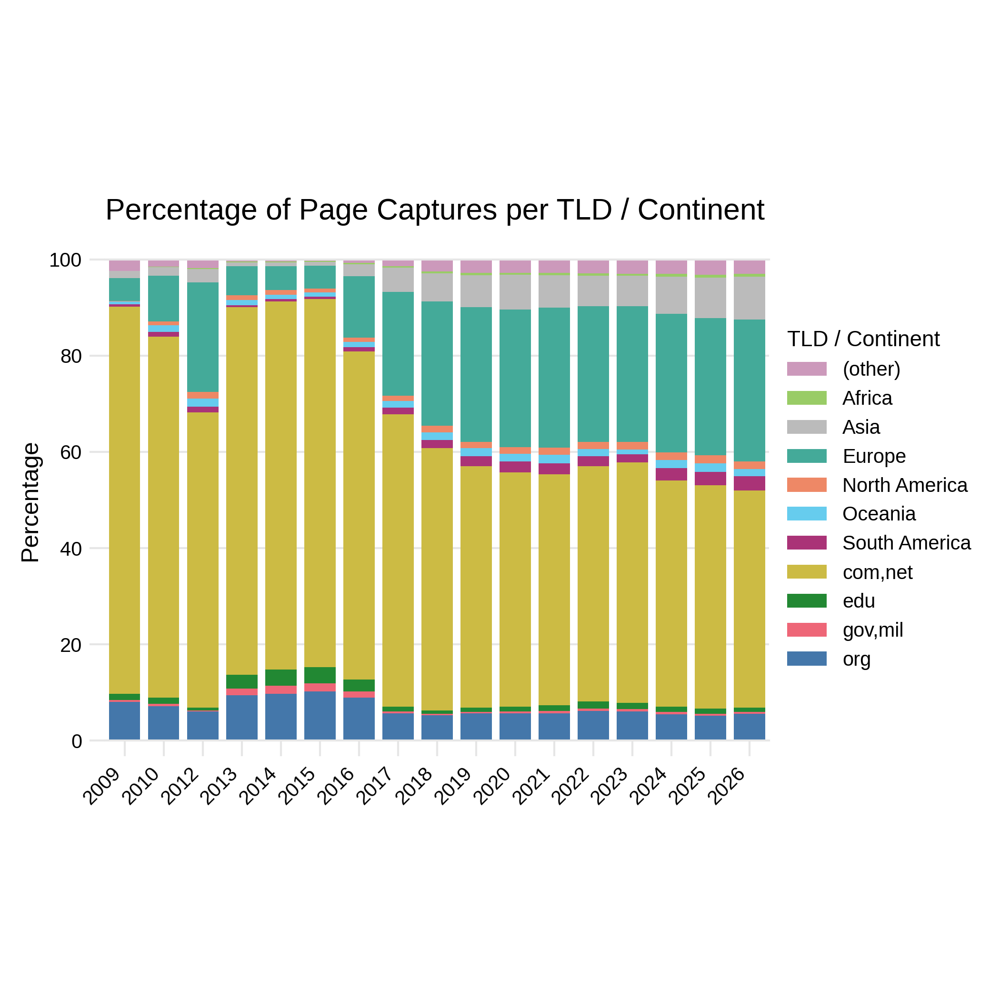

Top-Level Domains By Year and Continent
=======================================

Many top-level domains can be mapped to geographic regions, for example, the country-code TLDs or regional one (`.asia`). For other domains, such as `.com` or `.net` this is not possible. 

The aggregation by year and the percentage allows to better understand the long-term trends of top-level domain and geographical coverage. For the latter, TLDs are mapped to continents.
distribution over continents

The underlying data of the plot is provided in the table below or as CSV ([tlds-by-year-and-continent.csv](./tlds-by-year-and-continent.csv)).

The second table shows the percentage of the 16 most common top-level domains. The data is also provided as CSV: [selected-tlds-by-year.csv](./selected-tlds-by-year.csv).