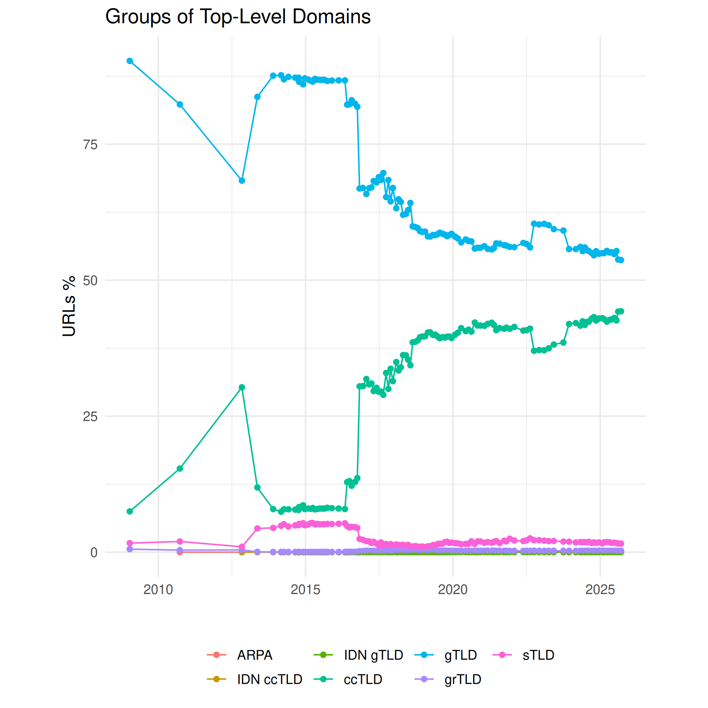

Groups of Top-Level Domains
===========================

The [IANA Root Zone Database](http://www.iana.org/domains/root/db) classifies top-level domains into the following groups:

- [generic](https://en.wikipedia.org/wiki/Generic_top-level_domain) ("gTLD"), not bound to a specific country. The core is formed by `.com`, `.info`, `.net` and `.org` TLDs, but was later extended to a long list of generic terms (`.creditcard`, `.bike`), or brands (`.apple`, `.volkswagen`), geographical or cultural entities (`.paris`, `.kiwi`)
- [sponsored](https://en.wikipedia.org/wiki/Generic_top-level_domain#Sponsored_gTLD) TLDs ("sTLD") are restricted to defined groups of users, registration of domains isn't open to anybody. That's obvious for `.gov`, `.mil`, `.edu` but also applies to `.museum` and others
- generic-restricted ("grTLD"): `.biz`, `.name` and `.pro`
- one single "infrastructure" TLD: `.arpa`
- [country-code top-level domains](https://en.wikipedia.org/wiki/Country_code_top-level_domain): `.uk`, `.fr`, `.jp`, etc.

The generic and country-code TLDs include [internationalized top-level domains](https://en.wikipedia.org/wiki/Internationalized_domain_name) written in non-Latin alphabets or containing non-ASCII characters. These are listed here as own groups:

- [internationalized country-code TLD](https://en.wikipedia.org/wiki/Internationalized_country_code_top-level_domain) ("IDN ccTLD"): `.рф` - Russia
- internationalized generic TLD ("IDN gTLD"): `.セール` - Japanese for 'sale', `.vermögensberatung` - German 'financial consulting'

Significant changes to the ratio between generic and country-code top-level domains happened in [May 2016](http://commoncrawl.org/2016/06/may-2016-crawl-archive-now-available/) (400 million seed donation by Moz.com) and [October 2016](http://commoncrawl.org/2016/11/october-2016-crawl-archive-now-available/) where we started to extend the crawl based on host/domain ranks and also increased the crawl size from 1.5--2 billion to about 3 billion pages.

While country-code TLDs have been underrepresented in crawls before 2016, the 30% share of country-code TLDs now comes closer to reality. In the present [Alexa top-1-million site list](http://s3.amazonaws.com/alexa-static/top-1m.csv.zip) (for details cf. [comparison of TLDs](./comparison)) 61% of the TLDs are generic and 38% country-code TLDs.

